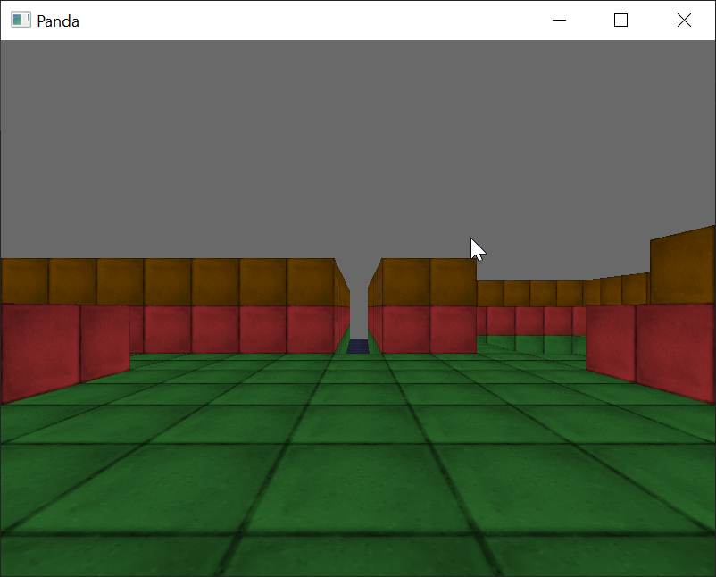

# Название проекта

A brief description of what this project does and who it's for





## Documentation

[Офф сайт какой нибудь библиотеки](https://linktodocumentation)


## Run Locally

описание кода

```
  какой то код
```

Go to the project directory

```bash
  cd my-project
```

Install dependencies

```bash
  npm install
```

Start the server

```bash
  npm run start
```

Название
короткое описание
скрины
структура кода
какие зависимости (модули, библиотеки)
